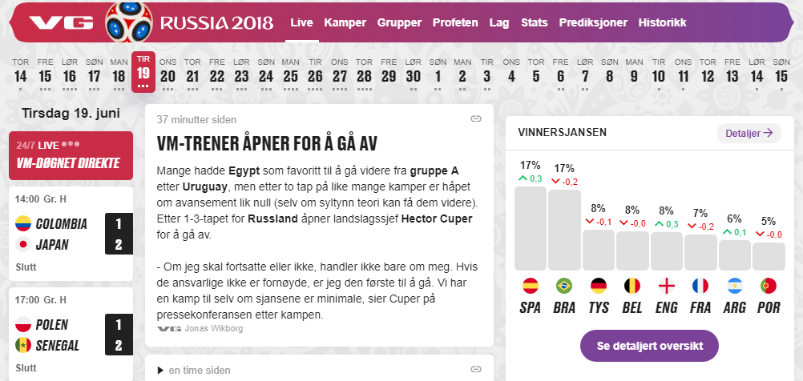

# vg-vm-video-blocker
Removes the (annoying) autoplaying videos from VGs 2018 World Cup site. 

## Before:

## After:

# How to install
1. Clone repository
2. Open the Extension Management page by navigating to chrome://extensions OR The Extension Management page can also be opened by clicking on the Chrome menu, hovering over More Tools then selecting Extensions.
3. Enable Developer Mode by clicking the toggle switch next to Developer mode.
4. Click the LOAD UNPACKED button and select the extension directory.
5. Load Extension
6. Ta-da! The extension has been successfully installed. Because no icons were included in the manifest, a generic toolbar icon will be created for the extension.

(https://developer.chrome.com/extensions/getstarted#manifest)
